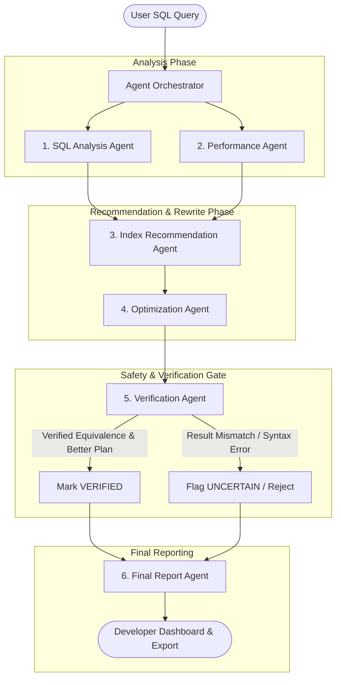

# QueryOpt AI — System Architecture & Agentic Workflow

## Overview

QueryOpt AI is an advanced, production-grade SQL query analysis, performance detection, and optimization assistant designed for database administrators, backend engineers, and data analysts.

Unlike simple single-turn LLM chatbots, QueryOpt AI employs a **deterministic and probabilistic multi-agent pipeline** with strict verification gates, physical query plan evidence, and semantic equivalence testing.

---

## The 6-Agent Pipeline

---

## Agent Specifications

### 1. SQL Analysis Agent
- **Tools**: `sqlglot` AST Parser
- **Responsibilities**: Extracts tables, projection columns, join conditions, WHERE predicates, aggregations, GROUP BY, and detects high-level antipatterns (`SELECT *`, Cartesian joins, non-sargable functions, leading wildcards).

### 2. Performance Analysis Agent
- **Tools**: SQLite `EXPLAIN QUERY PLAN`, `execute_and_time` micro-benchmarker
- **Responsibilities**: Analyzes the physical database execution plan to detect `SCAN TABLE` (O(N) operations), temporary sort buffers, and collects real execution latencies.

### 3. Index Recommendation Agent
- **Tools**: `schema_tool` (SQLite catalog inspector)
- **Responsibilities**: Matches unindexed filter columns, join keys, and composite filter-sort clauses against existing table indexes to generate actionable, non-redundant `CREATE INDEX` DDL statements.

### 4. Query Optimization Agent
- **Tools**: Google Gemini 1.5 Flash (with Rule-Based Fallback)
- **Responsibilities**: Generates sargable rewrites (e.g. converting `YEAR(date) = 2024` into `date >= '2024-01-01' AND date < '2025-01-01'`), replacing wildcard projections with explicit schema columns, and simplifying predicates while preserving semantics.

### 5. Verification Agent (Critical Safety Gate)
- **Tools**: `query_executor`, AST validator, EXPLAIN plan comparator
- **Responsibilities**: Executes both original and candidate queries on sample data to verify row-count and value-level semantic equivalence. Rejects or flags any candidate that changes output values or fails syntax checks.

### 6. Final Report Agent
- **Responsibilities**: Calculates standardized SQL Quality Scores (0-100), Performance Scores (0-100), determines Optimization Potential rating (`HIGH`, `MEDIUM`, `LOW`, `NONE`), and compiles the comprehensive JSON payload with full audit trajectory.

---

## Database Sandboxing & Security Model

- **Read-Only Mode**: Only `SELECT` and `EXPLAIN` queries are executed.
- **Destructive SQL Defense**: All `DROP`, `DELETE`, `TRUNCATE`, `ALTER`, `UPDATE`, and `INSERT` commands are blocked at parser and executor layers.
- **Zero Credential Exposure**: No credentials exposed in logs or API responses.
